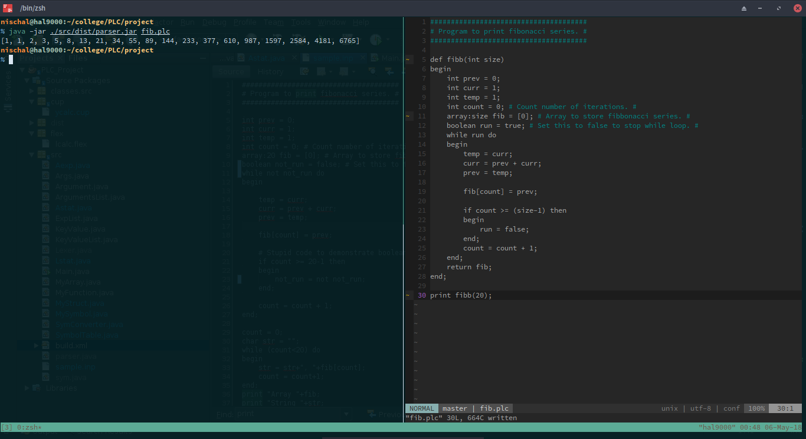
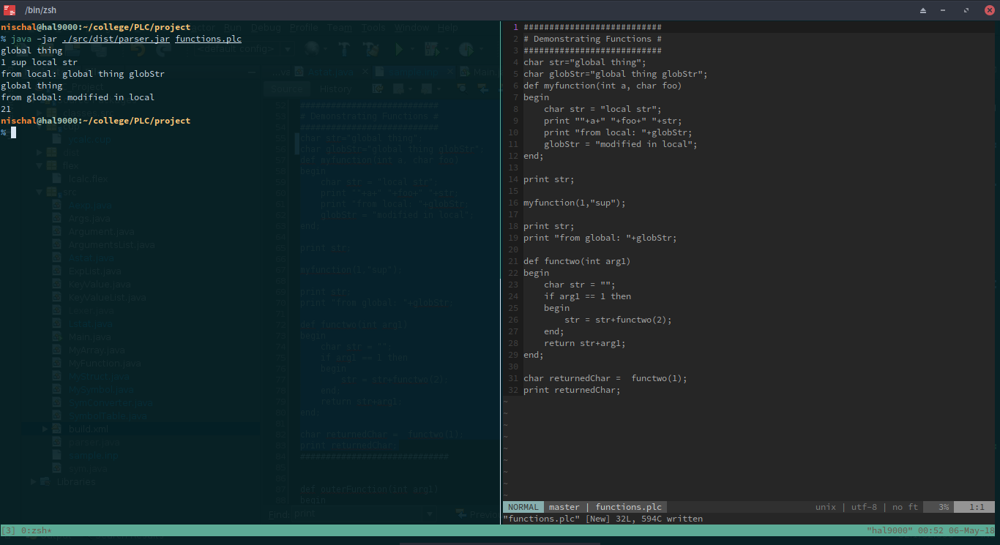
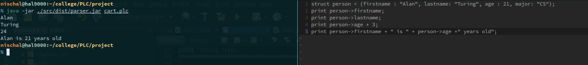

---
title:
- Programming Language and Compiler Final Project Report
author:
- B Nischal (st119982)
- C Kavin (st120089)
- M Sriram (st120001)
theme:
- metropolis
toc: true
numbersections: true
abstract:
- This report covers the project on Compiler. The compiler is designed for a specific language with given constraints. In this report, a brief description about grammar, semantic rules, type checking and type binding is explained. Screenshots of the demonstration of all the features are shown along with the inputs and outputs given. In the end, it is concluded with the program features and its limitations.
---

# Syntax

## primitives decleration
```
datatype variablename = expression;
```
```
datatype variablename;
```

## primitives assignment
```
variablename = expression;
```

## array decleration
```
array:arraylength variablename = [expression0, expression1];
```
```
array:arraylength variablename;
```

## array member assignment
```
variablename[expression] = expression;
```

## struct decleration
```
struct variablename = {key0: expression0, key1; expression1};
```

## struct member assignment
```
variablename->key =  expression;
```

## while loop
```
while booleanExpression
begin
...
...
end;
```

## function decleration
```
def returntype functionname(type0 argument0, type1 argument1)
begin
....
....
end; 
```

## function call
```
functionname(expression0, expression1);
```

# Grammar and Symantic Rules

```
    program         ->  statement_list:s {program.val = statement_list.val}


    statement_list  ->  statement_list:l statement_part:s 
                        {statement_list = statement_list.add(statement_part)}
                    |   statement_part:s 
                        {statement_list.add(statement_part)}


    statement_part  ->  statement:s SEMI;


    statement       ->  assignment:s {statement.val = assignment.val}
                    |   vardec:s {statement.val = vardec.val}
                    |   RETURN boolExp:e {statement.val = boolExp.val}
                    |   ifthen:s {assignment.val statement.val = ifthen.val}
                    |   print:s {statement.val = print.val}
                    |   while:s {statement.val = while.val}
                    |   functionDef:f {statement.val = functionDef.val }
                    |   boolExp:e {statement.val = boolExp.val}
                    |   BEGIN statement_list:s END {statement.val = statement_list.val}


    while           ->  WHILE boolExp:e DO statement:s 
                        {while.val = while boolExp.val==true do statement.val}


    print           ->  PRINT boolExp:e {print = print boolExp.val}


    ifthen          ->  IF boolExp:e THEN statement 
                        {ifthen.val = if boolExp.val==true then statement.val}
                    |   IF boolExp:e THEN statement1 ELSE statement2 
                        {ifthen.val = if boolExp.val==true
                                     then statement1.val else statement2.val}


    expListPart     ->  boolExp:e {expListPart.val = boolExp.val}


    expList         ->  expList:e_list COMMA expListPart:e 
                        {expList.val = expList.add(expListPart.val)}
                    |   expListPart:e {expList.add(expListPart.val)}


    vardec          ->  type:t ID:i ASS boolExp:e {symboltable.add(t,i,e)}
                    |   ARRAYDEF:a COLON boolExp:size ID:i ASS boolExp:e 
                        {symboltable.add(a,i,e)}
                    |   STRUCTDEF:s ID:i ASS boolExp:e {symboltable.add(s,i,e)}


    argumentPart    ->  type:t ID:i  {argumentPart.val = i.val}


    argumentList    ->  argumentList:a_list COMMA argumentPart:a 
                        {argumentList.val = argumentList.add(argumentPart.val)}
                    |   argumentPart:a {argumentList.val = argumentPart.val}


    functionDef     ->  FUNCDEF:f type:t ID:i LPAREN argumentList:a_list RPAREN 
                            BEGIN statement_list:s END 
                        {symboltable.add(f,i,val,s,t)}


    functionCall    ->  ID:i LPAREN expList:e_list RPAREN 
                        {symboltable.get(i).call(expList:e_List.val)}


    type            ->  INTDEF:i {type.val = int.val}
                    |   FLOATDEF:f {type.val = float.val}
                    |   BOOLEANDEF:b {type.val = boolean.val}
                    |   CHARDEF:c {type.val = char.val}
                    |   VOID:v {type.val = v.val}


    keyValuePart    ->  ID:i COLON boolExp:e {keyValuePart.val = boolExp.val}


    keyValueList    ->  keyValueList:kv_list COMMA keyValuePart:kv_part 
                        {keyValueList.val = keyValueList.add(keyValuePart.val)}
                    |   keyValuePart:kv_part {keyValueList.add(keyValuePart.val)}


    assignment      ->  ID:i ASS boolExp:e {symboltable.setValue(i.val, boolExp.val) }
                    |   ID:a LBRACKET boolExp:index RBRACKET ASS boolExp:e 
                        {symboltable.get(i).get(index) = e.val}
                    |   ID:s ARROW ID:key ASS boolExp:e {symboltable.get(i).get(key) = e.val}


    boolExp         ->  boolExp:e OR boolTerm:t {boolExp.val = e.val || t.val}
                    |   boolTerm:t {boolExp.val = t.val}


    boolTerm        ->  boolTerm:t AND notFactor:f {boolTerm.val = t.val && f.val}
                    |   notFactor:f {boolTerm.val = f.val}


    notFactor       ->  NOT boolFactor:b {notFacto.val = !b.val}
                    |   boolFactor:f {notFactor.val = f.val}


    boolFactor      ->  BOOLEAN:b {boolFactor.val = b.val}
                    |   relation:r {boolFactor.val = r.val}


    relation        ->  expr:e0 EQ expr:e1 {relation.val = e0 == e1}
                    |   expr:e0 NOTEQ expr:e1 {relation.val = e0 != e1}
                    |   expr:e0 GREATEREQ expr:e1 {relation.val = e0 > e1 || e0 == e1}
                    |   expr:e0 GREATER expr:e1 {relation.val = e0 > e1}
                    |   expr:e0 LESSEREQ expr:e1 {relation.val = e0 < e1 || e0 ==e1}
                    |   expr:e0 LESSER expr:e1 {relation.val = e0 < e1}
                    |   expr:e {relation.val == e.val}


    expr            ->  expr:e PLUS term:t {expr.val = e.val + t.val}
                    |   expr:e MINUS term:t {expr.val = e.val - t.val}
                    |   term:t {expr.val = t.val}


    term            ->  term:t TIMES factor:f {term.val = t.val * f.val}
                    |   term:t DIVIDE factor:f {term.val + t.val / f.val}
                    |   factor:f { term.val = f.val}


    factor          ->  LPAREN boolExp RPAREN {factor.val = boolExp.val}
                    |   INT {factor.val = INT.val}
                    |   FLOAT {factor.val = FLOAT.val}
                    |   MINUS INT {factor.val = -INT.val}
                    |   MINUS FLOAT {factor.val = -FLOAT.val}
                    |   CHAR {factor.val = CHAR.val}
                    |   array {factor.val = array.val}
                    |   struct {factor.val = struct.val}
                    |   functionCall {factor.val = functionCall.val}
                    |   ID LBRACKET boolExp RBRACKET 
                        {factor.val = symboltable.get(ID).get(boolExp)}
                    |   ID:i ARROW ID:j {factor.val = symboltable.get(i).get(j)}
                    |   ID {factor.val = ID.val}


    array          -> LBRACKET expList:e_list RBRACKET {array.val = expList.val}


    struct         -> LBRACE keyValueList:kv_list RBRACE {struct.val = keyValueList.val}
```

# Program Features

- This program helps in evaluating expressions like addition(+), subtraction(-), multiplication(*) and division(/). Apart from just mathematical operations, this program also evaluates comparison operators like less than, less than equal, greater than, greater than equal, equality and inequality and logical operators like Conjunction (and), Disjunction (or), Negation (not).

- The program supports the primitive data types Integer(int), Floating point numbers (float), Characters (char) and Booleans (boolean).

- The program supports the composite data types Arrays (array) and Cartesian products (struct).

- The program supports functions with  dynamic binding and copying mechanism for parameter passing.

Other Features include: 

- Print statement
- Variable declaration statement
- Assignment statement
- While loop
- Conditional statement (If-Else)
- Function declaration and Function call
- Cartesian products
- Arrays
- Type checking

- Boolean cannot operate with any other types and error handling is expected.
- Integer and float may operate with each other. Type conversion mechanism is provided if the operations between integer and float is possible. 
- Statement block and environment checking 
- The variable declared within a child environment should not be used in any higher level environment.

# Project Overview

## Project Structure
```
|-cup/
||-ycalc.cup
|-flex/
||-lcalc.flex
|-src/
||-Aexp.java
||-Args.java
||-Argument.java
||-ArgumentsList.java
||-Astat.java
||-ExpList.java
||-KeyValue.java
||-KeyValueList.java
||-Lexer.java   // generated by lcalc.flex
||-Lstat.java
||-Main.java
||-MyArray.java
||-MyStruct.java
||-MySymbol.java
||-SymConverter.java
||-SymbolTable.java
||-build.xml    // ant build descriptor
||-parser.java  // generated by ycalc.cup
||-sym.java     // generated by ycalc.cup

```
## Description of Files
- ```ycalc.cup```: Contains the grammar and symantic rules for the language.
- ```lcalc.flex```: Used to generate tokens from input string.
- ```Aexp.java```: Consists of the Aexp class which is used to represents an expression.
- ```Args.java```: Consists of the Args class, it's used to represent the arguments of an expression, it is passed to the constructor of the Aexp class when applicable.
- ```Argument.java``` and ```ArgumentList.java```:  ArgumentsList.java consists of the class ArgumentsList, which is composed of a ```LinkedList<Argument>```. The Argument class is a simple class with two attributes to store the type and name of the argument. The ArgumentsList class is used to describe a function's signature.
- ```Astat.java```: Consists of the Astat class which is used to represent statements of various types (variable declaration, variable assignment, if-then, if-then-else, block statements, while loop, function declaration and return statement). It consists of factory methods which construct instances of Astat for each different type of statements.
It also consists of a method ```execute()``` which then runs the suitable code for the type of statement that the instance of Astat is.
- ```Lstat.java```: Consists of the class Lstat which is composed of an ```ArrayList<Astat>``` to store a list of related statements, and has a method ```execute()``` which in turn loops over the elements in the list of statements and calls the ```execute()``` method of the individual statements.
- ```MySymbol.java```: Consists of the class MySymbol. It is mainly composed of two members variables, ```value``` which is of type ```Object``` so as to store the value of any given data type, and the ```type``` member variable to store the type of the value that is stored.
Throughout the application instances of the ```MySymbol``` class are used to represent various values and variables in a genaric manner. It also consists of methods to perform arthmetic, relation and boolean operations with other objects of ```MySymbol```.
It also consists of a static method ```getCompatableType(MySymbol, MySymbol)``` which returns the data type which an operation of two MySymbol objects should give (ex: integer and float would give float; integer and integer would give integer). If the two types are not compatable, an error is shown and the program exits.
- ```SymbolTable.java```: Consists of the class ```SymbolTable``` which is used to represent the program environment, it consists of three static member variables, globalTable and currentTable which are instances of SymbolTable, and symbolTableStack which is a stack of SymbolTable's. This class let's us declare variables and retrieve the values stored for those variables.
- ```ExpList.java```: Consists of the class ExpList which is composed of an ```LinkedList<Aexp>```. It is used to pass a list of expressions as arguments for functions as well as to declare arrays with a list of expressions.
- ```KeyValue.java``` and ```KeyValueList.java```: KeyValue is a simple class to store a single key value pair where the ```key``` is a ```String``` and value(named ```symbol```) is of type ```MySymbol```. It's main purpose is to be used in ```MyStruct```.
- ```MyArray.java```: Consists of the class ```MyArray``` which represents an array in our language.
- ```MyStruct.java```: Consists of the class ```MyStruct``` which represents a cartesian products in our language.
- ```MyFunction.java```: Consists of the class ```MyFunction``` which represents a function in our language. It is composed of the member variables of types ```Lstat```(to store the body of the function as a list of statements), ```ArgumentsList```(to store the parameters), ```String```(to store function name), ```int```(to store the return type) and ```MySymbol```(to store the return value). It also consists of the method ```call()```  which is called when the function is called in our program. The ```call()``` method adds a new SymbolTable to the SymbolTable stack (```SymbolTable.symbolTableStack```) followed by executing each statement in the list of statements until a return statement is encountered or all statements are executed, and then it finally pops the new SymbolTable out of the stack. If a return statement is encountered, it's value is stored in the returnSymbol memeber variable.
- ```SymConverter.java```: Consists of the class SymConverter. It consists of helper methods related to the variabels in sym.java, such as making them human readable.

## Application Workflow
- The program enters in ```Main.java``` where it uses ```Lexer``` to tokanize the input file. The ```parser``` then reads these tokens.
- The ```parser``` generates and passes around instances of ```Aexp``` and ```Astat```. None of the ```Aexp.getSymbol()```(which evaluate the expression and return a value) or ```Astat.execute()``` are called until the whole program is parsed and reduced, at which point, all the previous statements are stored within an instance of ```Lstat```. We then call ```execute()``` on this instance of Lstat, which then in turn executes all the statements and evaluates expressions under it.

# Limitations
- The program can not handle multi-dimensional arrays.

# Member Responsibilty

- Grammar Rules Production – Done by all of us.
- Type checking – Sriram and Nischal
- Report – Kavin
- *.java files – Nischal

# Examples






